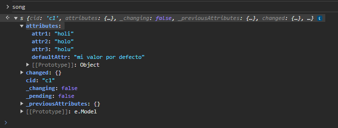
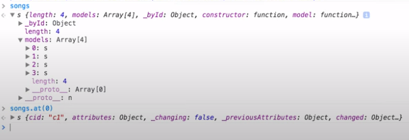

# Backbone.js

Depends on JQuery and underscore.js

```
<script src="http://cdnjs.cloudflare.com/ajax/libs/jquery/2.1.1/jquery.min.js"></script>
<script src="http://cdnjs.cloudflare.com/ajax/libs/underscore.js/1.7.0/underscore-min.js"></script>
<script src="http://cdnjs.cloudflare.com/ajax/libs/backbone.js/1.1.2/backbone-min.js"></script>
```

## Some code

```
var Song = Backbone.Model.extend({
  defaults: {
    defaultAttr: "mi valor por defecto"
  },
  initialize: function () {
    console.log("A new song has been created.");
  }
});

var song = new Song({
  attr1: "holi",
  attr2: "holo",
  attr3: "holu",
});
```

if we check the "song" object it has a property called "attributes" where Backbone all stores the data



### we can modify the attributes with these fuctions:

#### **get** `model.get(attribute)`

Get the current value of an attribute from the model. For example: note.get("title")

#### **set** `model.set(attributes, [options])`

Set a hash of attributes (one or many) on the model. If any of the attributes change the model's state, a "change" event will be triggered on the model. Change events for specific attributes are also triggered, and you can bind to those as well, for example: change:title, and change:content. You may also pass individual keys and values.

```
note.set({title: "March 20", content: "In his eyes she eclipses..."});

book.set("title", "A Scandal in Bohemia");
```

#### **escape** `model.escape(attribute)`

Similar to [get](https://backbonejs.org/#Model-get), but returns the HTML-escaped version of a model's attribute. If you're interpolating data from the model into HTML, using **escape** to retrieve attributes will prevent [XSS](https://en.wikipedia.org/wiki/Cross-site_scripting) attacks.

```
var hacker = new Backbone.Model({
  name: "<script>alert('xss')</script>"
});

alert(hacker.escape('name'));
```

#### **has** `model.has(attribute)`

Returns true if the attribute is set to a non-null or non-undefined value.

```
if (note.has("title")) {
  ...
}
```

#### **unset** `model.unset(attribute, [options])`

Remove an attribute by deleting it from the internal attributes hash. Fires a "change" event unless silent is passed as an option.

#### **clear** `model.clear([options])`

Removes all attributes from the model, including the id attribute. Fires a "change" event unless silent is passed as an option.

## Validation

We can validate a model with the validate attr it recieves a Fn with the attrs param that is a JSON with all the attributes of our Backbone Model and expect us to check for the existance of every requiret attribute and return a String to show an error when that attribute doesn't exist

```
var Song = Backbone.Model.extend({ 
	validate: function(attrs){
		if (attrs.title)
		return "Title is required";
	}
});

var song = new Song();
song.isValid(); 			 	// false
var lastError = song.validationError;  		// "Title is required"
```

## Model Inheritance

```
// Base Model
var Animal = Backbone.Model.extend({ 
	walk: function(){
		console.log("Animal walking...");
	}
});

// Extended Model
var Dog = Animal.extend({
	// Overrided method of the Parent
	walk: function(){
		// With this line we can also execute the parent method 
		Animal.prototype.walk.apply(this);

		// And the overrited version at the same time
		console.log("Dog walking...");
	}
});

var dog = new Dog();

dog.walk();

/*
	// IN CONSOLE 
	"Animal walking..."
	"Dog walking..."
*/
```

## Syncing Models with the Server

### Persistent operations

#### fetch()

always issues a GET request

#### save()

**depending on the state of the object make a POST or a PUT request**

if the object is new, it sends a POST request, otherwise it sends a PUT request

##### how to know if an object is new o not?

    if its been fetched from the server before it assumes its an existing object (PUT), otherwise it assumes its a new object until its saved to the server

#### destroy()

always issues a DELETE request

### urlRoot

this is a required property to use the operations to sync with the server
if you don't specify the urlRoot and call one of the operations sync with the server, you will get an error telling you that the URL is not defined

```
var Song = Backbone. Model.extend({
	urlRoot: "/api/songs"
});

// if our website is located in the domain example.com, the url will be 
example.com/api/songs
```

### Fetching a Model

```
var song = new Song ({ id: 1 }); 

song.fetch();

// this resolves in a HTTP GET to this URL (notice the id property with a "1")
// GET /api/songs/1
```

### Updating a Model

```
var song = new Song({ id: 1 });
song.fetch();
...
song.set("title", "newTitle");
song.save();

// in this case because the object is been fecthed from the server before, it's an existing object and as a result Backbone will issue a PUT request
// PUT /api/songs/1
```

### Inserting a Model

```
var song = new Song(); 
song.set("title", "Title");
song.save();

// in this case Backbone will issuea a POST request to the song COLLECTION
// POST /api/songs
```

### Deleting a Model

```
var song = new Song({ id: 1 });
song.destroy();

// DELETE /api/songs/1
```

### Changing the default id attribute convention

```

var Song = Backbone. Model.extend({
	idAttribute: "songid" 
});

var song = new Song({ songId: 1 });
// Notice that instead of seting the "id" property convention, in this case we use the new custom "songId" convention for the Model id attribute

```

### Callbacks

```
var song = new Song();
song.fetch({
	success: function() { ... },
	error: function() { ... },
});

song.destroy({
	success: function() { ... },
	error: function() { ... },
});

// save is diferent, it first accept a Hash of attributes to set and save
// if you pass the callbacks as the FIRST argument, won't be executed upon return from the server.
song.save({}, {
	success: function() { ... },
	error: function() { ... },
});

```

## Collections

Backbone collection are oredered setr of Models, they are usefull when you want to work with a group of models

### Create a Collection

To create a Collection we extends from "Backbone.Collection" and specify the type of Models the Collection can hold.

```
var Song = Backbone.Model.extend();
var Songs = Backbone.Collection.extend({ 
	model: Song
});
```

### Add Models to a Collection

We can add Modes to a Collection by passig them in the creation of the Collection

```
var songs = new Songs([
	new Song({ title: "Song 1" }), 
	new Song({ title: "Song 2" }), 
	new Song({ title: "Song 3" })
]);
```

Or we can also use the .add() method (from *underscore*) to add a Model to the Collection

```
songs.add(new Song({ title: "Song 4" }));
```

with the .add() method, you can also pass a second paramether to especify the index of the new Model of the Collection

the second paramether must be JSON with a property called "at", wich specify the index

```
songs.add( new Song({ title: "Song 5" }), { at: 0 } );
```

or you can use the .push() method to insert a Model at the end of the collection

```
songs.push( new Song({ title: "Song 6" }) );
```

### Collection properties

Every Collection have a "length" property and the "models" property that contains all the Models added to that Collection



Every Backbone Model have two IDs, one is the "persistent ID" wich is assignes by the server, and the other is the "CID" (client ID) wich is assigned by Backbone.
the CID is a temporary identifier that Backbone uses to keep track of objects.

### Getting Models from a Collection

We can get a Model from a Collection by its ID (persistent ID or the CID) or by it index in the collection

```
// You can use the .at() method (from underscore) to access a Model from its index in the Collection "models" property
var firstSong = songs.at(0);

// or you can access a Model with any of its two IDs (in the image above oyu can see that the CID is "c1")
var songWithIdC1 = songs.get("c1");
```

### Removing Models from a Collection

You can remove a Model from a Collection using the .remove() method (from *underscore*), the remove() method expects a Model, so you need to get the Model by either its index or its ID an then pass it to the method.

```
songs.remove( firstSong );
songs.remove( song.get("c2") );
```

you can also use the .pop() method to remove de Model at the end of the Collection

```
songs.pop();
```

### Finding and Filtering Models in a Collection

#### Finding Models

##### .where()

we can find multiple Models from a Collection using the method .where() (from *underscore*)
this method search for Models with the attribute/value pairs passed as parameters (you can pass multiple pairs to have more complex filters)
in case of Strings, the comparison are case-sensitive
the .where() method returns an Array of Models matching the filters passed as a JSON

```
songs.where( { genre: "Jazz" } );
songs.where( { genre: "Jazz", title: "song 2" } );
```

##### .findWhere()

is the same as Where but returns only the first instance

#### Filtering with custom logic

We can filter the Models in the Collection with the .filter() method (also from *underscore*)
the .filter() method accepts a Predicate ( a function that accepts an input and **returns boolean(true/false) as an output**)

```
const topDownloads = songs.filter( (song) => {
	return song.get("downloads") > 100;
});

const longSongs = songs.filter( (song) => ( song.get("duration") > 300000 ) ); // more than 300 sec / 5 min

console.log("Top Downloads", topDownloads);
console.log("Song with duration more than 5m", longSongs );
```

### Iterating all Models in the Collection

We can iterate all the Models with the .each() method
the each() function expects a callback function that will be executed at each iteration, and this function recieves the Model in the current iteration

```
songs.each(function(song) {
	console.log(song);
});
```

### Sync Collection with Server

```
var Songs = Backbone.Collection.extend({
	model: Song
	url: "/api/songs"
});

var songs = = new Songs();
songs.fetch();

// GET /api/songs
```

Backbone uses Jquery to make aJax calls
you can pass aditional parameters using the "data" hash as seen below

```

songs.fetch({
	data: {
		page: 2,
		maxItems: 12
	},
	success: function() {},
	error: function() {},
});

// GET /api/songs?page=2&maxItems=12
```

## View

The Backbone View is the object responsable for rendering the content of the view aswell as responding to any event raised from there (clicks, drag and drops, press keys, etc)
Backbone Views are like Controllers in MVC

### Render content

Every View has a DOM element at all times, this element is by default an empty DIV
if you especify a DOM element that exists on the page, the view attaches itself to it, otherwise, the view will create a DOM element.

```
const SongView = Backbone.View.extend({
	render: function() {
		this.$el.html("holi");
		return this;
	}
});

let songView = new SongView({ el: '#container' });
songView.render();
```

We can especify some properties to change the element created by the View

* tagName
* className
* id
* attributes

```
const NewView = Backbone.View.extend({
	tagName: 'section',
	className: 'my-view-section',
	id: '123',
	attributes: {
		"data-something": 'something'
	},
});
```

### Respond to DOM / Model events

```
var Song = Backbone.Model.extend();
var SongView = Backbone.View.extend({ 
	events: {
		"click": "onclick"
	},

	onClick: function(){
		console.log("Listen Clicked");
	},

	render: function() {
		this.$el.html(this.model.get("title") + " <button>Listen</button>");
		return this;
	}
});
 
var song = new Song({ title: "Blue in Green" });
var songView = new SongView({ el: "#container", model: song }); 

songsView.render();
```
